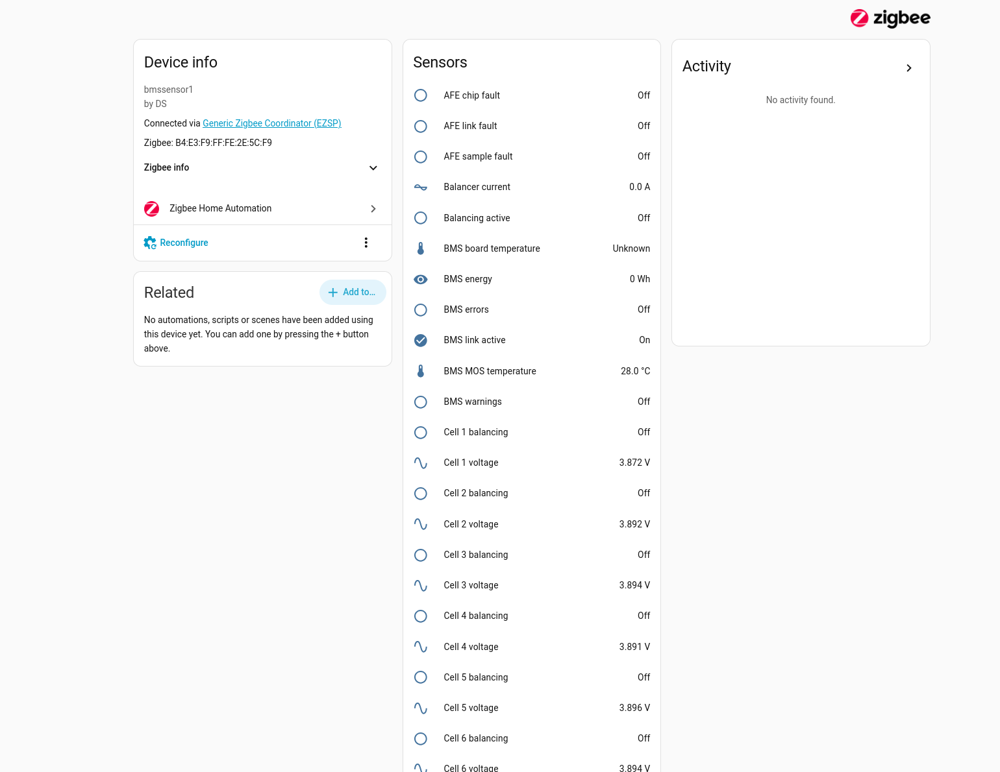
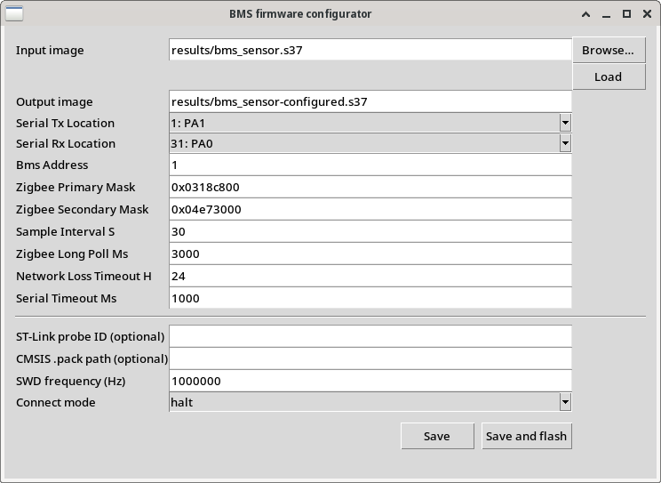

# DALY BMS Zigbee sensor for EFR32MG1B

This project turns an EFR32MG1B232F256 Zigbee module into a sleepy, read-only
sensor for DALY H/K/M/S-compatible and 100balance BMS controllers. It reads the
BMS over a 9600-baud serial connection and exposes 130 values on 57 standard
Zigbee Home Automation endpoints. The Zigbee manufacturer is `DS` and the model
is `bmssensor1`.



The protocol implementation was informed by the
[ESPHome DALY H/K/M/S component](https://github.com/patagonaa/esphome-daly-hkms-bms),
then tested against the connected 100balance 60 A 4–8S controller. Optional
registers are exposed only with explicit validity handling; a successful read of
a zero value is not treated as proof that every BMS implements that function.

## Features

- Pack, charge, discharge, balancer, individual-cell and temperature telemetry.
- Standard Electrical Measurement, Temperature Measurement, Analog Input and
  Binary Input clusters; no proprietary Zigbee cluster is required.
- Writable Analog Value update interval in seconds, retained in NVRAM.
- Basic `ProductLabel` attributes identify each endpoint's physical subject.
- Persistent binding/reporting configuration and automatic rejoin behavior.
- Factory reset and fresh network steering after a configurable prolonged loss
  of the parent, or immediately after explicit coordinator removal.
- Sleepy-end-device operation with EM2 between serial and Zigbee work.
- Supply supervision before flash-backed writes.
- CRC-protected settings embedded in the flashable image.
- Optional open-source ST-Link flashing through pyOCD.

The complete Zigbee layout is in [ENDPOINTS.md](ENDPOINTS.md). Attribute naming
and endpoint labels are described in [NAMING.md](NAMING.md). Image customization,
pin mappings, channel masks and flashing are covered by
[CONFIGURATION.md](CONFIGURATION.md).

## Hardware and configurable defaults

The verified development hardware uses an Ebyte E180-ZG120A module and a
MAX485-based transceiver with automatic direction control. The shipped image has
these defaults:

| Setting | Default |
| --- | --- |
| USART0 TX | location 18, PD10 |
| USART0 RX | location 19, PD12 |
| Serial format | 9600 baud, 8N1 |
| BMS logical address | 1 (`0x81` request, `0x51` reply) |
| Sampling interval | 30 seconds |
| Zigbee long poll | 3000 ms |
| Lost-network reset | 24 hours |

PD10/PD12 are the image defaults. TX and RX are independently configurable
across all USART0 locations supported by this MCU.
For example, location 18/18 selects TX=PD10 and RX=PD11, while location 19/19
selects TX=PD11 and RX=PD12. The firmware and configuration tool reject pairs
that resolve to the same physical GPIO.

The image also permits changing the BMS address, Zigbee primary and secondary
channel masks, sampling interval, long-poll interval, network-loss timeout and
serial timeout without recompiling.



Launch the configurator with:

```sh
python3 tools/configure_image.py --gui results/bms_sensor.s37
```

See [CONFIGURATION.md](CONFIGURATION.md) for CLI examples, the complete USART0
location table, integrity checks and pyOCD installation instructions.

## Home Assistant and ZHA

Home Assistant ZHA displays the standard measurement and general-input clusters.
The optional [ZHA naming quirk](zha/README.md) combines each endpoint's
`ProductLabel` with its measurement, producing names such as `Cell 1 voltage`,
`Pack current` and `Probe 1 temperature`. Description-bearing Analog Input and
Binary Input clusters retain their firmware-provided field names. The quirk
changes display metadata while preserving entity IDs, values, scaling, history
and reporting.

Copy [zha/bmssensor1.py](zha/bmssensor1.py) into the Home Assistant custom ZHA
quirks directory and follow the installation instructions in
[zha/README.md](zha/README.md).

## Prebuilt firmware

The latest build is included as:

- [results/bms_sensor.bin](results/bms_sensor.bin) — flat binary at address 0.
- [results/bms_sensor.s37](results/bms_sensor.s37) — Motorola S-record image.

The default image uses PD10 for TX, PD12 for RX and BMS address 1. Customize a copy
before flashing when different wiring or network settings are required.

With pyOCD and the EFR32MG1B CMSIS pack installed, an ST-Link can program either
format:

```sh
python3 tools/configure_image.py results/bms_sensor.bin --flash
```

Physical ST-Link programming has not yet been tested on this board. The pyOCD
target definition, Silicon Labs flash algorithm, image-range checks and
ST-Link-only probe selection have been verified in software.

## Building

The production build was generated with Gecko SDK 4.5.1, Simplicity Commander
tools and Arm GNU Toolchain 12.2.1. Point `EFR32_ENV` at an environment script
that defines `GSDK` and `ARM_GCC_DIR`; it defaults to the path used for the
verified build:

```sh
export EFR32_ENV=/opt/silabs/efr32mg1-2026-09/env.sh
bash scripts/test.sh
bash scripts/build.sh
```

Build output is written to `build/`, with the two distributable images copied to
`results/`. The build regenerates the endpoint table from `tools/metrics.py`,
runs structural checks, and links with size optimization.

Source responsibilities are separated as follows:

- `src/bms_protocol.*`: DALY request framing, CRC and response parsing.
- `src/rs485.*`: USART routing, interrupts and power requirements.
- `src/bms_metrics*`: BMS register conversion and Zigbee mapping.
- `src/zigbee.*`: attributes, reporting, joining and network recovery.
- `src/app_config.*`: validated host-patchable image settings.
- `src/settings.*`: persisted runtime sampling interval.
- `src/supply.*`: voltage supervision.
- `firmware/main.c`: application scheduling.

## Zigbee operation

Endpoint 1 exposes **Update interval** through Analog Value (Basic) `0x000E`.
Write `PresentValue` (`0x0055`, single-precision float) with a whole number of
seconds from 5 to 3600. It starts from the image's `sample_interval_s` on first
boot, then restores the NVM3 value on subsequent boots and firmware updates.
Writes are acknowledged only after storage succeeds. An interval change
reschedules the next sample and lets an active read cycle finish.
See [CONFIGURATION.md](CONFIGURATION.md#runtime-update-interval) for details.

The device starts network steering ten seconds after boot and retries once per
minute while unjoined. A successful join allows five minutes for the initial ZHA
interview; relevant discovery/configuration requests extend that window. Parent
polling is fast during interview and returns to the configured long-poll interval
afterward.

If a joined device cannot reach its parent, it retains credentials and uses the
stack's secure rejoin behavior. Continuous loss beyond the configured timeout
clears coordinator-owned bindings/reporting data, leaves the unavailable network
and starts fresh steering. An explicit coordinator removal starts the same path
immediately.

Every query block becomes valid only after a fresh CRC-checked reply. Missing
analog, electrical and temperature values use their standard invalid encodings.
Binary values retain their last state during a serial failure and are accompanied
by invalid reliability/status flags; the `BMS communication` entity should be
checked before relying on such a stale state.

## Power and upgrades

The application uses calibrated AVDD monitoring before persistent writes. Its
nominal falling threshold is 2.4 V, with recovery near 2.6 V plus hardware
hysteresis. Actual supply-current, voltage-ramp and external hold-up measurements
remain board-level validation tasks.

The current application is too large to retain a complete second image alongside
the running image in the MCU's 256 KiB internal flash. This build therefore does
not provide Zigbee OTA storage. Firmware can be updated over SWD while preserving
the NVM3 pages containing network state.

## License

This project is distributed under the [BSD 2-Clause License](LICENSE).
